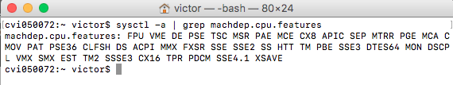
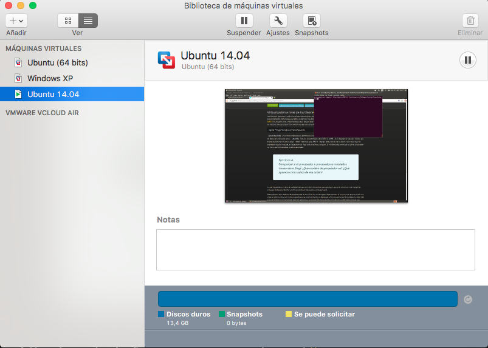

## EJERCICIOS TEMA 1


### Ejercicio 1: Consultar en el catálogo de alguna tienda de informática el precio de un ordenador tipo servidor y calcular su coste de amortización a cuatro y siete años. [Consultar este artículo en Infoautónomos sobre el tema.](http://infoautonomos.eleconomista.es/consultas-a-la-comunidad/988/)

**Servidor -->** [HP ProLiant ML310E G8 V2](https://www.pccomponentes.com/hp-proliant-ml310e-g8-v2-intel-xeon-e3-1220v3-4gb-1tb)
**Coste -->** 659€
**Base imponible (sin IVA)-->** 544.63€

[Aquí](https://ayuda.cuentica.com/tabla-anos-porcentajes-amortizacion-simplificada-autonomos-y-profesionales/) se muestra cuanto es lo amortizado según el grupo 5, que corresponde a *Equipos de tratamiento de información y sistemas y programas informaticos*.
Así que su coeficiente lineal máximo es del **26%** en un periodo máximo de **10 años**.
Por tanto, tenemos 544.63€ al 26% anual, quedando **141.60€** amortizable como máximo por año.

-Para 4 años obtenemos por año **136.15€**.
-Para 7 años obtenemos por año **77.80€**.

Por tanto no se sobrepasan los límites fijados.

### Ejercicio 2: Usando las tablas de precios de servicios de alojamiento en Internet y de proveedores de servicios en la nube. Comparar el coste durante un año de un ordenador con un procesador estándar (escogerlo de forma que sea el mismo tipo de procesador en los dos vendedores) y con el resto de las características similares (tamaño de disco duro equivalente a transferencia de disco duro) en el caso de que la infraestructura comprada se usa sólo el 1% o el 10% del tiempo.

Suponiendo que todos los meses tiene 30 días, por tanto tenemos 720 horas mensuales.

-Para el 1% de uso al mes es: 7.2 horas
-Para el 10% de uso al mes es: 72 horas

| Compañia  | Procesador | RAM | Disco | €/hora | Coste 1% uso al mes | Coste 10% uso al mes |
|:-:|:-:|:-:|:-:|:-:|:-:|:-:|
| [OHV.es SP-60](https://www.ovh.es/vps/vps-cloud-ram.xml)  | 4 vCores 2,4 GHz | 60 GB | 400 GB | 0.194 €/hora | 1.40 € | 14 € | 
| [1&1 Servidor Cloud FLEX](https://www.1and1.es/costs?__lf=Order-Tariff) | 4 vCores 2,0 GHz | 60 GB | 400 GB| 0.640 €/hora | 4.61 € | 46.1 € |


### Ejercicio 3:

### Apartado 1: ¿Qué tipo de virtualización usarías en cada caso? Comentar en el foro

**-Virtualización plena -->** Programa para virtualizar un sistema completo.
**-Virtualización parcial -->** Para simular más memoria RAM de la que dispongo, el SO virtualiza parte del disco duro como si fuera memoría RAM.
**-Virtualización a nivel de sistema operativo -->** En un servidor pueden convivir varios SO virtualizados, de esta forma, se virtualizan los recursos y ellos creen que son los anfitriones.
**-Virtualización de aplicaciones -->** Para poder usar una aplicación que ha sido creada para un SO distinto al anfitrión.
**-Virtualización de entornos de desarrollo -->** Para poder comprobar que lo desarrollado funciona, sin afectar ni perjudiar al anfitrión ante u posible error.


### Apartado 2: Crear un programa simple en cualquier lenguaje interpretado para Linux, empaquetarlo con CDE y probarlo en diferentes distribuciones


Ubuntu:


### Ejercicio 4: Comprobar si el procesador o procesadores instalados tienen estos flags. ¿Qué modelo de procesador es? ¿Qué aparece como salida de esa orden?

**Procesador -->** Intel(R) Core(TM)2 Duo CPU     P8800  @ 2.66GHz

En el caso de macOS, ha de usarse el comando ```sysctl -a | grep machdep.cpu``` donde aparece **VMX**




### Ejercicio 5:

### Apartado 1: Comprobar si el núcleo instalado en tu ordenador contiene este módulo del kernel usando la orden ```kvm-ok```.

Por el ejercicio anterior, se demuestra que macOS es capaz de crear los dispositivos virtuales de entra y salida.

### Apartado 2: Instalar un hipervisor para gestionar máquinas virtuales, que más adelante se podrá usar en pruebas y ejercicios.



